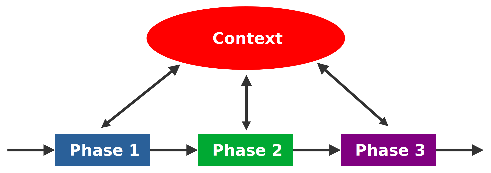

# Effekt Module-System 
Author: Roman Schulte

## Introduction

- Currently there is no module system
- Everything is a global definition
- Imports reference files
- No way of limiting access (private/public)

## Current compiler design


Making Phases in-out seams reasonable on the first glace. But research has shown that decompositions of systems using a flow-chart like approach has its problems.
These problems are visible in form of:
- Global side-effects with the `Context` object
- Output of phases does not represent the actual result of the phase
    - Currently most phases just pass their input to the output
    - Phases are thighly coupled to the current abstraction of a module

### Advantages
- Compiler does not read/write files directly
- Code-Generation depends mainly on the `core.Tree` data structure  
    - => smaller changes in the lanugae syntax does not require to update generators/backends

### Disadvantages
- Global Symbol Database does not support private definitions (potential naming clashes)
- Module Map does keep track of nesting
- 1 File <==> 1 Module
    - This assumption is deeply coupled in nearly every phase
    - Makes it hard to implement a new module system without touching/affecting every phase
    - Allowing multiple module defs has side-effects in the whole compilation pipeline
- Imports define exactly one location where the module might be stored
- Compiler Phases do not produce an actual new output, but perform side-effects on global state
- Context is an all-round object => Violates single purpose design
- Imports are resolved directly in namer which requires the imported modules to be fully compiled


## Proposed Compiler Design
This section proposes a new design for the Effekt compiler that aims to reduce

### Goals and Non-Goals
Goals are
- Reduce
    - Coupling between Context and the phases
    - Global side effects
- Modules
- Interfaces
- Access Privileges
- Modules as first-class citizen
- Make Compile Phases pure
    - Goal: Reduce side-effects to make incremental compilation easier/more predictable
- Decoupling Phases from Context
    - Goal: Make phases independant of Context
    - Throw exceptions instead of the abort method
  

Non-Goals
- Solving the initialization problem

### Challenges
- Incremental Compilation
- Content Discovery (Auto-Completion)
- Difference: Namespace/Module/File
- mutal recursion
- Ambigious imports:
```
module foo {
    def bar() = //

    module bar {

    }
}

import foo.bar // Does the user want to import the module foo.bar or only the function bar from module foo?
```

## Design Decisions
- Each module can only be defined once
    - Might be relaxed later
    - Multiple module def with the same qualified name result in a compile error
- A File does not implicitly declare a module
    - => Per default every top-level delaration inside a file is a global declaration
- Imports cannot point to files, only to Symbols (Modules, defs, variables)


## Phases
Concept: Phases dependend on their previous phases
Each successfully completed phase increases the knowledge of the compiler about the user's program
Phases are designed to encapsulate knowledge and hide information about how this knowledge was aquired
=> Vgl. Parnas
Every Phase provides a (read-only) API for follow up Phases

Strengths:
- Inserting a new phase require only small adaptions
- Appending a Phase does not touch/change previous state
- Each Phase has access to the knowledge aquired by a previous phases, without relaying on global state
- The result of a phase (e.g. Transformation) can be used by multiple follow-up phases (JS Generator and Chez Generator)
- State changes in one phase cannot affect previous phases
- Removes responsibilities from the CompilerContext

Weaknesses:
- Removing phases requires larger refactorings

```scala
trait Phase {
    def run()
    def update()
}
```

### Parsing
> "Give me a source element (`source.Tree`) and I tell you where it was defined (source, line, offset)."

```scala
class Parser() {
    def sources: Iterable[Source]

    def contentOf(source: Source): source.ToplevelDecl
    def sourceOf(element: source.Tree): Source
    def positionOf(element: source.Tree): (Source, Position)
}
```

### Symbol Index
> "Give me a symbol and I tell you who owns it."

- Looks at:
    - ModuleDefs
    - Heads of other defininitions (blocks, values, etc)

- is responsible for Symbol creation and managment
- provides lookup methods to find modules
- ModuleContext provides read-only interface to the contents of a module

- Module Exploration
    - "Give me the name of a module and I tell you what's inside (symbols, submodules)"
    - Hides: File structure, Which Symbol is defined in which file
    - Handling:
        - Merging multiple sources into one program

```scala
trait SymbolIndex {
    def ownerOf(symbol: Symbol): SymbolOwner
    def sourceOf(symbol: Symbol): Source
}

trait SymbolOwner {
    def symbols: Map[String, Symbol]
    def types: Map[String, TypeSymbol]
    def terms: Map[String, TermSymbol]
    def effects: Map[String, Effect]
    def modules: Map[String, ModuleSymbol]

    def children: Map[String, SymbolOwner]
}
```

### Module Exploration
Creates a module tree
different from symbol owners:


```scala
class ModuleExplorer(parser: Parser) {
    def globalScope: ModuleContext
    def userModules: Iterable[ModuleContext]


    def module(name: Name): Option[ModuleContext]

    def definitionOf(module: Name): Option[source.ModuleDef]
    
    // Lookup the source in which the given module was defined
    def sourceOf(module: Name): Source

    // Lookup the module which contains the symbol
    // If the symbol is a ModuleSymbol return the corresponding ModuleContext
    // Else return the ModuleContext of the module to which the symbol belongs (either the global module or an user module)
    def moduleOf(symbol: Symbol): ModuleContext

    def indexOf(source)
    def indexOf(module)
    def indexOf(block)
}

// Interface for
trait ModuleContext {
    def parentOption: Option[ModuleContext]
    def symbolOption: Option[ModuleSymbol]

    def allSymbols: Iterable[Symbol]

    def types: Iterable[TypeSymbol]
    def terms: Iterable[TermSymbol]
    def effects: Iterable[Effect]
    def submodules: Iterable[ModuleSymbol]
}
```

### Reference Resolution
> "Give me a reference and its context (global, module, block) and I tell you which symbol is referenced"

- Looks at:
    - Imports
    - Scopes (source/module/block)
- Features
    - Type-aliases
    - Trailing-syntax

- Reference Resolution
    - "Give me a reference and its context (global, module, block) and I tell you which symbol is referenced"
    - Hides: How was the reference resolved? (local name, qualified name, alias?)
    - Handling:

```scala
class ReferenceResolver(modules: ModuleExplorer) {
    def scopeOf(symbol: Symbol): ResolutionScope
}


```

### Type Checking
- Type-checking
    - "Give me a stmt and I tell you if the types are compatible"
    - Hides: How did we find out the type of a symbol
    - Handling:
        - Type-inference

```scala
class TypeChecker(resolver: ReferenceResolver) {
    def typeOf(stmt: Stmt): Effectful
    def checkTypeOf(stmt: Stmt, expectedType: ValueType): Option[Effectful]
}
```

### Transformation
> "Give me the name of a module and I translate it to the effekt system (`core.Tree`)"

```scala
class Transformer(previous: TypeChecker) {
    def transformGlobalModule(): core.Module
    def transform(module: Name): core.Module
}
```

### Code Generation
> "Give me the name of a module and I translate it to JS/Scheme/etc"

```scala
class Generator {
    def generate(module: Name): Document
}
```

## Outlook
Describe how this model can solve:

- Incremental Compilation
    - Pass updates through affected phases
- IDE-Features like
    - Refactor name
    - Jump To Definition
    - Auto-Complete
        - AutoCompleteContext which has access to ModuleExplorer/ Resolver
        - Find possible meanings for input (e.g. "foo.ba" => ["foo.bar", "foo.baz", "foo.bar(hello: String)"])
- Compile multiple backends at once
    - Setup pipeline
    - Use Transformer phase as input for the generators
- Private symbols
    - Implement in ModuleContext
- Block Parameters as Symbols
    - Currently Parameters are not represented as Symbols
    - Making them Symbols could unify the resolution of block parameters with other symbols.
- Blocks as SymbolOwner
    - Could allow imports and local function definitions inside Blocks
    - Introduce subclass of Symbol: ScopeSymbol which is either a Block or a Module
- Module interfaces

## Material
- Namespaces in Flix